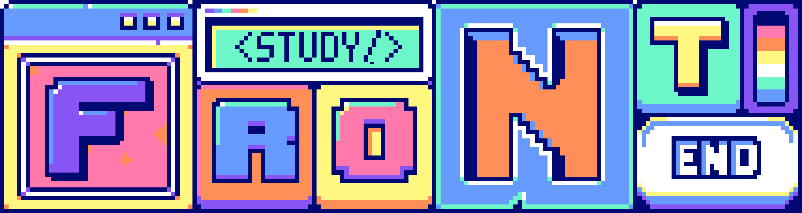

# Vending Machine - 인터넷 음료수 자판기

## 소개 및 개요
* 프로젝트 기간: 2023.04 ~ 2023.05
* 리팩토링 기간: 2023.07 ~ 2023.08
* 배포 URL: [🔗Vending-Machine]([https://spport-dozen.netlify.app/](https://hyeri-woo.github.io/vending-machine/))

## 프로젝트 설명
* Vending Machine은 음료수 자판기 기능을 제공하는 반응형 웹 사이트입니다. 
* 소지금을 입금하거나 음료수를 장바구니에 담고 최총 획득을 하는 등 기본적인 자판기 기능을 제공합니다. 
* 그 외 장바구니에 든 음료수의 갯수를 조절하거나 랜덤 음료수를 구매하는 등 부가적인 기능도 제공합니다. 

## 목차 
1. [기술 및 개발 환경](#기술-및-개발-환경)
2. [프로젝트 구조](#프로젝트-구조)
4. [UI](#ui)
5. [주요 기능](#주요-기능)

## 기술 및 개발 환경
* 사용한 언어: HTML/CSS, JavaScript
* 사용한 라이브러리/프레임워크: SCSS,
* 배포: GitHub Pages

## 프로젝트 구조
```
🥫 vending-machine
├─ 📄 index.html
├─ 🗓️ items.json
├─ 📌 README.md
├─ 📁 audio
├─ 📁 css
   ├─ _common.scss
   ├─ _media.scss
   ├─ _variables.scss
   ├─ style.css
   ├─ style.scss
   └─ index.js
├─ 📁 img
└─ 📁 js
   ├─ index.js
   └─ 📁 classes
       ├─ commonFunc.js             ----------- 📜 필요한 공통 함수
       ├─ modals.js                 ----------- 📜 모달 공통 함수 
       ├─ cartDrinkGenerator.js     ----------- 🧩 장바구니 음료 제조 관련 함수
       ├─ drinkGenerator.js         ----------- 🧩 자판기 안 음료 제조 관련 함수
       ├─ startScreenEvents.js      ----------- 🧩 시작 이벤트 화면 및 bgm 관련 함수
       └─ vendingMachineEvents.js   ----------- 🧩 자판기 이벤트 관련 함수
```

## 주요 기능
### 시작 화면 및 전체 기능

- 시작 화면 클릭시 메인 화면으로 이동하며 bgm이 시작됩니다. 
- 오른쪽 하단의 버튼을 클릭하여 bgm을 멈추거나 다시 재생할 수 있습니다. 
- 오른쪽 하단의 reset 버튼을 클릭하여 자판기를 리셋할 수 있습니다. 
### 입금액 충전과 반환

- 소지금 50000원 내에서 입금액을 충전할 수 있습니다. 
- 입금 금액이 50000원보다 높거나 마이너스 값이 될 시 입금할 수 없으며 경고창이 뜹니다. 
- 최소 단위는 1000으로 사용자가 1000보다 작은 단위로 입력시 자동으로 반올림됩니다. 
- 거스름돈 반환 시 잔액을 소지금으로 추가합니다. 

### 음료수 장바구니에 넣기

- 사고 싶은 음료수 버튼을 클릭하여 현재 장바구니에 담을 수 있습니다. 
    - 장바구니에 담긴 음료수는 주황색과 민트색으로 변합니다. 
- 랜덤 음료수는 10% 확률로 **프론트엔드 마스터 음료수**를 획득할 수 있습니다. 
- 소지금이 부족하거나 음료수가 품절됐을 경우 음료수를 장바구니에 담을 수 없습니다. 

### 현재 장바구니에서 음료수 수량 조절

- 현재 장바구니의 담긴 음료수 위에 마우스를 호버하면 수량을 줄이거나, 늘리거나, 없앨 수 있습니다. 
- 구매할 때와 같이 소지금이 부족하거나 음료수가 품절됐을 경우 음료수 수량을 늘릴 수 없습니다. 

### 음료수 구매

- 획득 버튼을 누르면 현재 장바구니에 담긴 음료수를 획득할 수 있습니다. 
- 랜덤 음료수는 10% 확률로 **프론트엔드 마스터 음료수**를 획득할 수 있습니다. 


## 핵심 기능 - Promise/async/await를 사용한 custom confirm 창 구현 
- [구현 블로그 글](https://velog.io/@woohyeri0525/promise-async-await%EB%A5%BC-%EC%82%AC%EC%9A%A9%ED%95%9C-custom-confirm-%EC%B0%BD-%EB%A7%8C%EB%93%A4%EA%B8%B0)
### onModal 함수

```js
onModal(title) {
    return new Promise((resolve) => {
        this.modal.showModal();
        this.modal.querySelector("h2").textContent = title;
        this.modal.querySelector("p").textContent = this.msgWarning.get(title);
        this.common.allAriaLive(this.modal.querySelector("h2"));
        this.common.allAriaLive(this.modal.querySelector("p"));
        new Audio("./audio/notify.mp3").play();
        this.modal.querySelector(".btn-cancel").addEventListener("click", () => {
        resolve(0);
        });
        this.modal.querySelector(".btn-yes").addEventListener("click", () => {
        resolve(1);
        });
    });
}
```

### 사용법
```js
onBtnRemove(currentItem, target) {
    ...
    if (!(await this.modal.onModal("Remove Item from Cart"))) return;
    ...
}
```

- onModal에서 사용자의 답변을 기다린 뒤 행동을 실행합니다. 

## 핵심 기능 - 키보드 접근성을 강화하여 웹사이트의 사용성과 웹접근성 향상 

- [구현 블로그 글](https://velog.io/@woohyeri0525/%EC%9B%B9-%EC%A0%91%EA%B7%BC%EC%84%B1-%ED%96%A5%EC%83%81%EC%8B%9C%ED%82%A4%EA%B8%B0-%ED%82%A4%EB%B3%B4%EB%93%9C-%EC%A0%91%EA%B7%BC%EC%84%B1-%ED%8E%B8)

### dialog로 모달의 키보드 접근성 강화
- esc로 모달에서 나갈 수 있습니다. (dialog 태그 기본 제공)
- tab으로 이동 시 모달 안에서만 이동합니다. (dialog 태그 기본 제공)
- div 태그에서 dialog를 사용하여 모달에 필요한 기본적인 키보드 접근성을 강화시켰습니다. 

### 시작 화면 키보드 접근성 강화
- tab을 한번 누른 뒤 엔터를 이용해 메인 화면으로 이동할 수 있습니다. 
- 처음 focus를 press start 버튼으로 이동시키고 keydown 이벤트 리스너를 추가했습니다. 

### bgm 켜고 끄기
- 메인 화면에서 s를 누를시 bgm을 켜고 끌 수 있습니다. 
- 메인 화면에 keydown 이벤트 리스너를 추가했습니다. 

### 입금액 엔터를 사용해 입금하기
-  form 태그를 추가하여 입금 버튼을 누르지 않더라도 엔터 키 만으로 입금할 수 있습니다. 


## 핵심 기능 - 스크린 리더 사용자 (맥 Voice Over)를 고려한 웹 접근성 향상 

- [구현 블로그 글](https://velog.io/@woohyeri0525/%EC%9B%B9-%EC%A0%91%EA%B7%BC%EC%84%B1-%ED%96%A5%EC%83%81%EC%8B%9C%ED%82%A4%EA%B8%B0-%EC%8A%A4%ED%81%AC%EB%A6%B0-%EB%A6%AC%EB%8D%94-%ED%8E%B8)

### aria-label과 a11y-hidden을 이용한 자세한 안내문
- aria-label의 경우 시각적으로 보이는 콘텐츠에 대체 텍스트 제공합니다. 이미지나 버튼과 같이 시각적으로 보이는 요소에 대체 텍스트를 제공하고 싶을 때 aria-label을 사용했습니다. 
    - button과 input의 경우 본래 목적에 대해서 충분히 나와있지 않으면 aria-label 속성을 추가하여 부가적인 설명을 했습니다.  
- a11y-hidden의 경우 레이블이나 안내문을 시각적으로 감추면서 스크린 리더 사용자에게만 제공합니다. 특정 요소의 레이블이나 안내문을 시각적으로는 표시하지 않으면서 스크린 리더 사용자에게만 제공하고자 할 때 a11y-hidden 클래스를 사용했습니다. 
```html
<header>
    <h1></h1>
    <button class="btn-press" aria-label="시작 버튼">
      	<span class="a11y-hidden">시작하기 위해 화면을 클릭하거나 엔터를 누르세요.</span>
  	</button>
    <div class="slot-wrapper"></div>
</header>
```
- 해당 기능으로 음료수 자판기에 필요한 기능들을 보다 자세하게 들을 수 있고 키보드로 쉽게 사용할 수 있습니다. 

### aria-live: 변경된 값 읽어주기
- aria-live 속성은 동적으로 업데이트되는 콘텐츠를 스크린 리더 사용자에게 즉시 알릴 때 사용되는 접근성 속성입니다. 이 속성을 사용하면 사용자의 주의를 끌고, 변경된 정보를 놓치지 않도록 도와줍니다. 하지만 바뀐 값만 읽어주기에 allAriaLive 함수를 사용해 변경됐을 경우 필요한 문장 전체를 읽어줍니다. 
```js
allAriaLive(target) {
    target.setAttribute("aria-live", "off");
    target.offsetWidth; // Reflow를 트리거하여 스크린 리더가 내용을 다시 읽도록 함
    target.setAttribute("aria-live", "polite");
    setTimeout(() => {
      target.removeAttribute("aria-live");
    }, 1000);
}
```
- 해당 기능으로 입금액, 소지금, 잔액 등등을 헷갈리지 않고 사용할 수 있습니다. 

### aria-live: 특정 행동 읽어주기
- aria-live를 사용해 특정 행동을 했을 때 알려줄 수 있습니다. 
```js
announceMessage(message) {
    const liveRegion = document.createElement("div");
    liveRegion.setAttribute("role", "region");
    liveRegion.setAttribute("aria-live", "assertive");
  	liveRegion.classList.add("a11y-hidden");
    liveRegion.textContent = message;
    document.body.appendChild(liveRegion);
    setTimeout(() => {
      liveRegion.remove();
    }, 3000);
}
```
- 해당 기능으로 음료수를 담았을 때 행동을 읽어주기에 무슨 행동을 했는지 한번 더 확인할 수 있습니다. 

### 음료수 조절 기능
- hover 됐을 때만 조절 가능하므로 해당 요소에 tabindex를 추가해 조절기능을 어떻게 하는지 설명하고 쉽게 키보드를 이용해 사용할 수 있도록 했습니다. 
```js
btnKeyboard(currentItem) {
  currentItem.addEventListener("keydown", (event) => {
    if (event.key === "ArrowLeft") {
      currentItem.querySelector(".btn-sub").click();
      this.allAriaLive(currentItem);
    } else if (event.key === "ArrowRight") {
      currentItem.querySelector(".btn-add").click();
      this.allAriaLive(currentItem);
    } else if (event.key === "ArrowUp") {
      currentItem.querySelector(".btn-remove").click();
    }
  });
}
```
